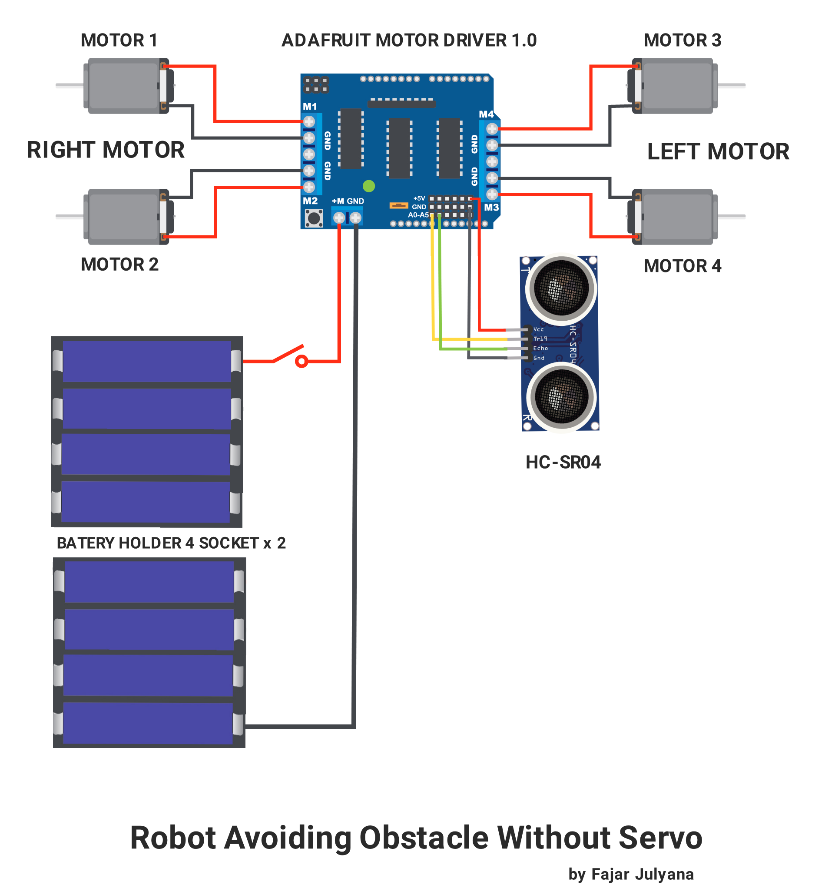
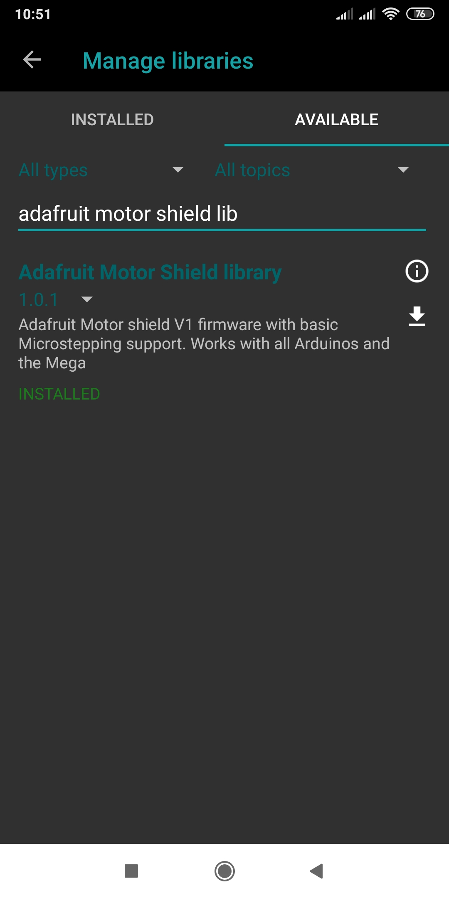

# ROBOT AVOIDING OBSTACLE TANPA SERVO

```
 created by fajar julyana
```

## Alat yang diperlukan

1. Smartphone/Komputer/Laptop
2. USB OTG (jika pakai smartphoe/tablet
3. ARDUINOIDE(Ubuntu/windows) atau ARDUIONODROID(smartphone)
4. Gunting/Cutter
5. Power Supply DC switch 3v - 13v | 0.200 - 2A
6. Obeng Set
7. iron Solder

## Bahan yang diperlukan

1. Arduino Uno R3 Chip CH340G(1x)
2. Adafruit Motor Driver Shield (1x)
3. Switch on/off (1x)
4. Rubber Wheels(4x)
5. TT Gear Motor(4x)
7. Ultrasonic Sensor (x1)
8. Alkaline 1.5v size AA Battery(8x)
9. Battery Holder size AA (4x2)
10. polycarbonate untuk chasis (seperlunya)
11. 3m double tip (1x)
12. Dupont/Jumper Cable Female to Female (seperlunya)
13. cable 
14. extra pinout soldering
15. timah/patri solder

## Wiring
   Pengkabelannya
   </img>
## Code

1. Tambahkan Library NewPing
   [NewPing Library](https://downloads.arduino.cc/libraries/bitbucket.org/teckel12/NewPing-1.9.7.zip)
   </img>
2. Tambahkan Library Adafruit1.0
   [Adafruit Motor Shield v1 Library](https://downloads.arduino.cc/libraries/github.com/adafruit/Adafruit_Motor_Shield_library-1.0.1.zip)
   </img>

Berikut Codenya.
https://github.com/fajarjulyana/robot-avoiding-obstacle-without-servo/blob/dd704ae040cf24c6a573e41a3ce46c7016c28cc0/src/code.cpp#L8-L17

## Dokumentasi
</img>
